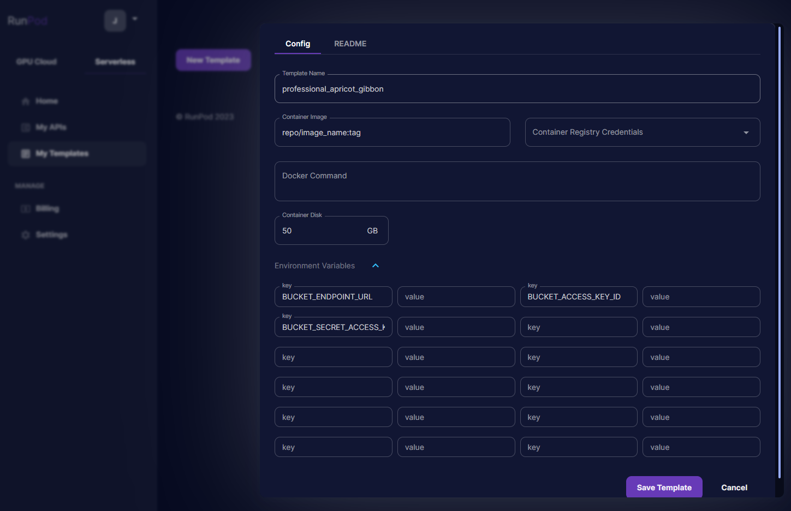
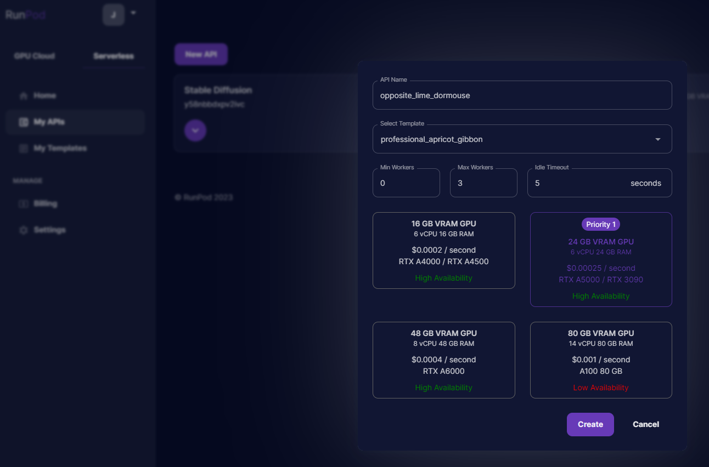
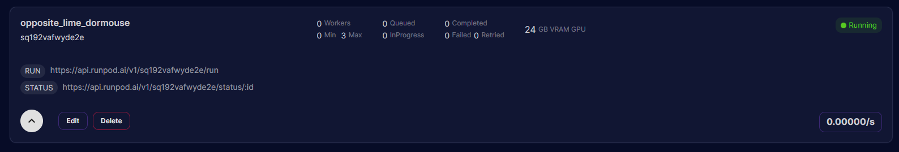

# Serverless | Model Checkpoint Template

This repository provides an end-to-end template for deploying your own Stable Diffusion Model to RunPod Serverless. The setup scripts will help to download the model and set up the Dockerfile.

## Setup

You will need the following:

- Image repository (e.g., Docker Hub)
- RunPod account
- Selected model from [HuggingFace](https://huggingface.co/models)
- S3 bucket (optional)
-
```BASH
git clone https://github.com/runpod/serverless-ckpt-template.git
cd serverless-ckpt-template

docker build --build-arg MODEL_URL={huggingface.co/model/id} -t repo/image_name:tag .
docker push repo/image_name:tag
```

Once you have pushed your Docker image, navigate to the [Serverless Templates](https://www.runpod.io/console/serverless/user/templates) on RunPod.







## Usage

To use your endpoint see our [Endpoint Docs](https://docs.runpod.io/ai-endpoints/runpod-apis)
